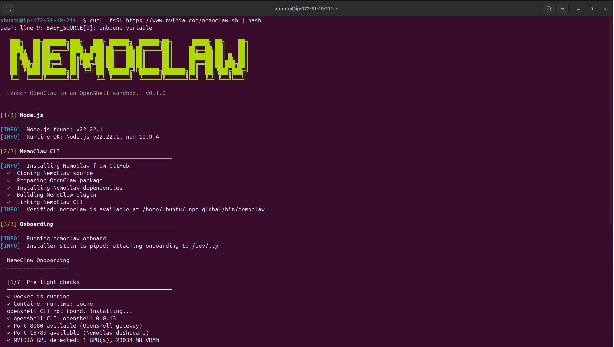

# openshell-nemoclaw-redteaming


Technically this should be probably be redteaming at Openshell level as the agent is probably a blackbox here. One should test for the hypothesis of can an attacker make an agent to jailbreak from policies and constraints set as a part of open shell


## Setting up Nemoclaw on AWS EC2 instance
After logging into EC2 instance via terminal

```
sudo apt update && sudo apt upgrade -y
```

1) <b>Docker</b> - Check if docker is installed. Usually it would already be there
```
docker -v 
```
Also run this to double check
```
docker run hello-world
```
2) Node.js installation
```
curl -fsSL https://deb.nodesource.com/setup_22.x | sudo -E bash -
sudo apt install -y nodejs
node --version 
```
3) Configure npm permissions properly - Sometimes running a command in sudo doesnt work. This is basically creating a symlink to ~/.npm-global as opposed to /usr/lib/node_modules
```
mkdir -p ~/.npm-global
npm config set prefix '~/.npm-global'
echo 'export PATH=~/.npm-global/bin:$PATH' >> ~/.bashrc
source ~/.bashrc
```
4) Test GPU availability - Optional
```
nvidia-smi
```
5) Get Nvidia-API for Inference - Optional but its free for set tokens
https://build.nvidia.com/settings/api-keys

6) Install GitHub CLI - This is required to download OpenShell
```
sudo apt install -y gh
```

7) Install NemoClaw CLI
```
curl -fsSL https://www.nvidia.com/nemoclaw.sh | bash
```
You will be asked to authenticate to authenticate to github - The steps should be straight-forward

After the installation is done, you will see the below:- (Probably somnething similar)


Machine specs can be found <a href="./nemoclaw_onboarding/AWS_EC2_specs_for_Nemoclaw - Google Docs.pdf">here</a>